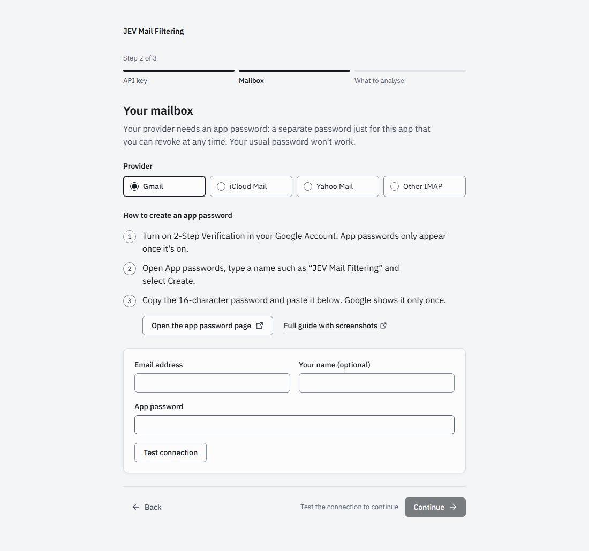

# Connect Gmail

🇪🇸 [Leer en español](gmail.es.md)

JEV Mail Filtering signs in to Gmail over IMAP with an **app password**: a 16-character password that only this app uses and that you can revoke at any time. Your normal Google password does not work here.

> Provider websites change. If what you see differs from these steps, follow what is on the screen.

## Before you start

- **2-Step Verification must be on.** Google only offers app passwords when it is. Turn it on at [myaccount.google.com/security](https://myaccount.google.com/security) → *2-Step Verification*.
- **Work or school accounts (Google Workspace):** your administrator may have disabled app passwords or IMAP. If the steps below do not work, ask them.
- IMAP is enabled by default for personal Gmail accounts; you do not need to change anything in Gmail's settings.

## Steps

1. Open [myaccount.google.com/apppasswords](https://myaccount.google.com/apppasswords) and sign in if asked.
2. Type a name such as `JEV Mail Filtering` and select **Create**.
3. Copy the 16-character password that appears. Google shows it only once.
4. In the setup wizard (step 2, *Your mailbox*), choose **Gmail**, enter your full Gmail address and paste the app password.
5. Select **Test connection**. When it says *Connected*, continue.

**With Docker**, put the app password in your `.env` file as `IMAP_PASSWORD` and restart the container; leave the password field in the wizard empty.

## Server settings

The wizard fills these in for you:

| Setting | Value |
|---|---|
| IMAP server | `imap.gmail.com` |
| Port | `993` |
| TLS | On |
| Username | Your full address, e.g. `you@gmail.com` |

## Common problems

| Problem | What to do |
|---|---|
| The App passwords page says the setting is not available | 2-Step Verification is off, your account uses Advanced Protection, or your Workspace administrator has disabled app passwords. |
| *The server rejected the email or app password* | Check that you used the full address. If you copied the password with spaces and it is rejected, paste it without them. If it still fails, create a new app password. |
| It worked before and now fails | Changing your Google password revokes your app passwords. Create a new one and enter it in the wizard (or in `.env`). |
| *Could not reach the service* / timeouts | A firewall or network may be blocking port 993. Try another network. |

To disconnect, remove the app password at [myaccount.google.com/apppasswords](https://myaccount.google.com/apppasswords). The app never modifies your mailbox: nothing is moved, deleted or marked as read.
