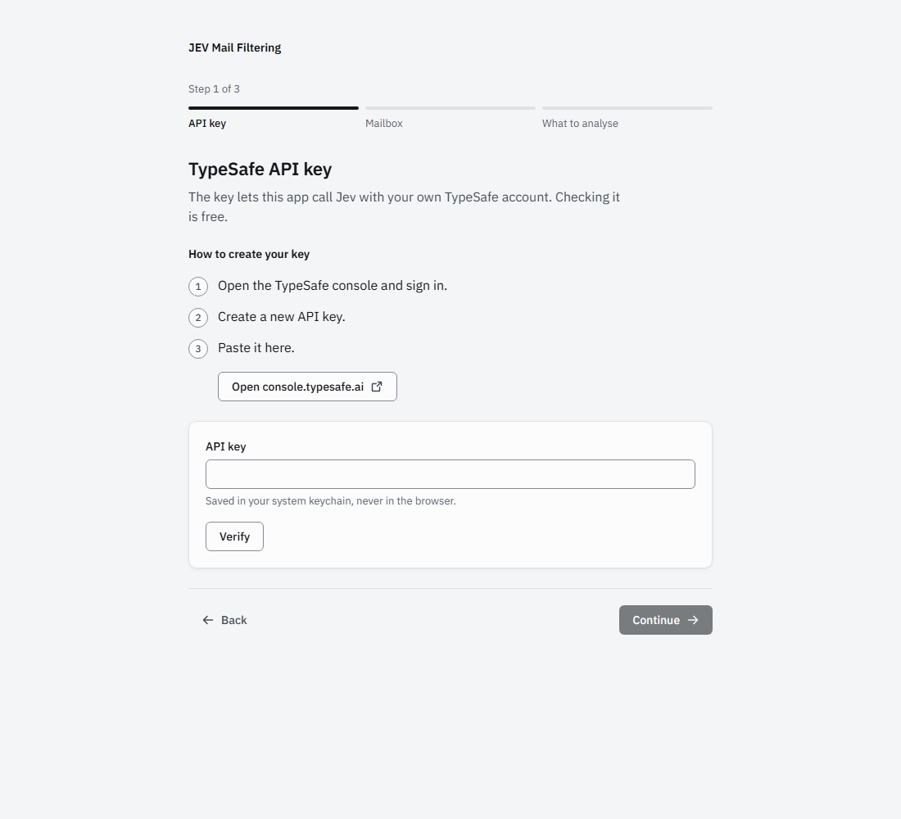

# Crear una clave de API de TypeSafe

🇬🇧 [Read in English](typesafe-key.md)

JEV Mail Filtering clasifica cada correo con Jev, el modelo de TypeSafe, usando **tu propia** cuenta de TypeSafe. La clave se queda en tu ordenador y solo la usa el servidor local.

> Las webs de los proveedores cambian. Si lo que ves no coincide con estos pasos, sigue lo que aparece en pantalla.

## Antes de empezar

- Una cuenta de TypeSafe con acceso a Jev. Jev está en acceso anticipado; si tu cuenta aún no tiene acceso, consulta [¿Aún no tienes acceso?](#aún-no-tienes-acceso) más abajo.

## Pasos

1. Abre [console.typesafe.ai/keys](https://console.typesafe.ai/keys) e inicia sesión.
2. Crea una clave de API nueva. Ponle un nombre que reconozcas, como `JEV Mail Filtering`.
3. Cópiala en ese momento; puede que no vuelvas a verla.
4. En el asistente de configuración (paso 1, *Clave de API de TypeSafe*), pégala y pulsa **Verificar**. La verificación solo lista los modelos disponibles, así que no cuesta nada.



La clave se guarda en el llavero de tu sistema operativo (Llavero en macOS, Administrador de credenciales en Windows, Secret Service en Linux), nunca en el navegador.

**Con Docker**, pon la clave en tu fichero `.env` y reinicia el contenedor:

```bash
TYPESAFE_API_KEY=tu-clave
```

## Cuánto cuesta

Jev se factura por token de entrada (unos 0,042 $ por millón en el momento de escribir esto; la salida es gratis). En la bandeja de demostración un correo ocupa unos 1.150 tokens de entrada, así que 1.000 correos cuestan unos cinco céntimos. El asistente muestra una estimación antes de la primera sincronización y el panel muestra el total acumulado.

## ¿Aún no tienes acceso?

Si estás en lista de espera, puedes ver igualmente la app en marcha con la bandeja de demostración, que usa respuestas de Jev grabadas y no necesita clave:

```bash
DEMO_MODE=1 npm start    # desde un clon, tras npm install y npm run build (consulta el README)
```

En Windows PowerShell: `$env:DEMO_MODE="1"; npm start`. Cuando el paquete esté publicado en npm, `npx jev-mail-filtering --demo` hará lo mismo sin clonar.

## Problemas frecuentes

| Mensaje | Qué hacer |
|---|---|
| *La clave ha sido rechazada* | La clave se copió incompleta o se borró en la consola. Cópiala de nuevo o crea otra. |
| *No se pudo conectar con el servicio* | Revisa tu conexión a internet, VPN o proxy, y vuelve a intentarlo. |
| La clasificación se detiene más tarde con un error de clave o de permisos | La clave se revocó, o la cuenta se quedó sin saldo o perdió el acceso a Jev. Revisa la consola; lo ya clasificado sigue visible. |

Para dejar de usar la clave, bórrala en la consola y pulsa **Ajustes → Borrar todos los datos locales** en la app.
